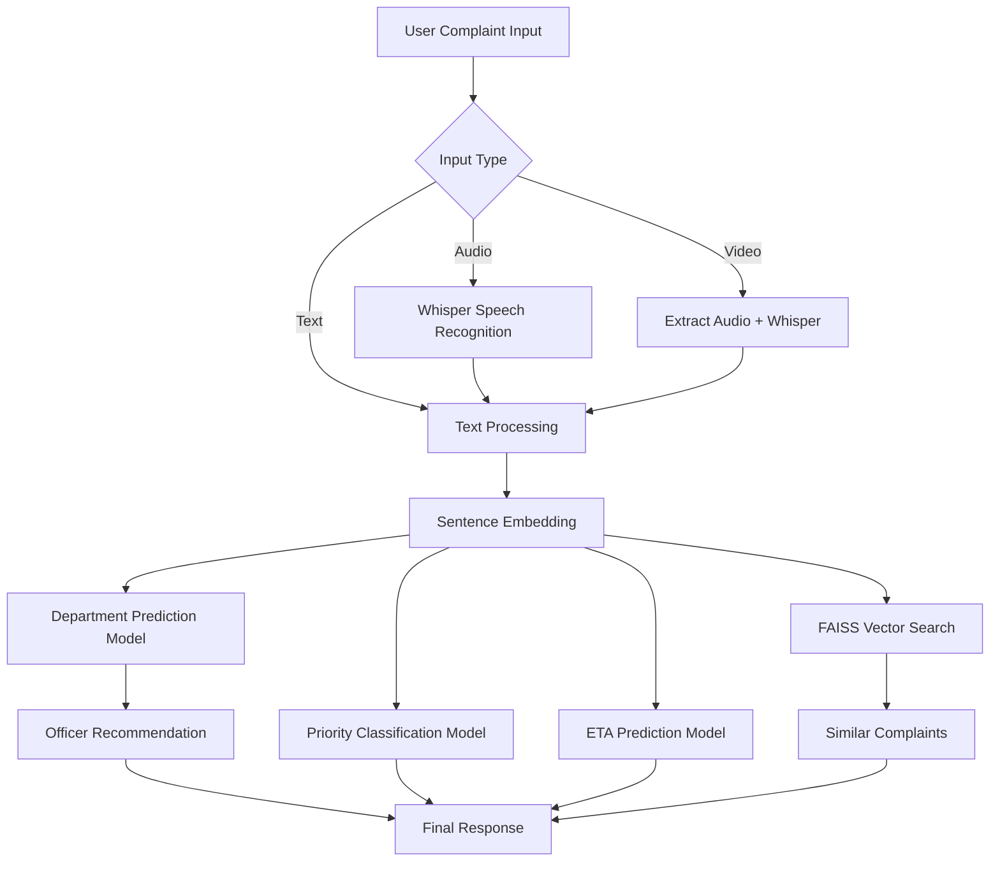
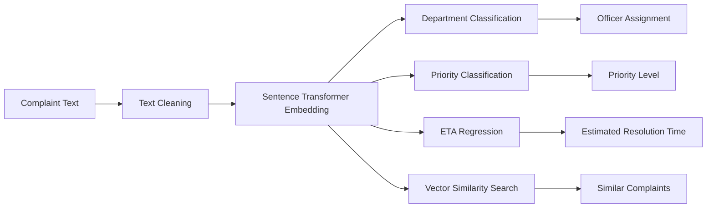

# AI Complaint Routing & Resolution Prediction System

An **AI-powered complaint management system** that automatically analyzes citizen complaints and performs intelligent routing and prediction tasks.

The system accepts **text, audio, and video complaints**, converts them into structured information, and predicts:

* Department responsible for handling the complaint
* Complaint priority level
* Estimated resolution time
* Recommended officers
* Similar past complaints

This project demonstrates how **Natural Language Processing, Machine Learning, and Vector Search** can be used to build an intelligent public service complaint system.

---

# Project Features

The system performs multiple tasks automatically:

### Department Routing

Predicts the correct department responsible for resolving the complaint.

Example:

```
Complaint: Water leakage near main road

Prediction: Water Department
```

---

### Priority Classification

Determines urgency level.

Priority classes:

* High
* Medium
* Low

---

### Resolution Time Prediction

Predicts **Estimated Time of Resolution (ETA)** in days using regression models.

---

### Officer Recommendation

Suggests the most suitable officers based on department and historical complaint assignments.

---

### Similar Complaint Search

Uses **vector similarity search** to retrieve similar complaints from past records.

This helps officers understand:

* Previously solved cases
* Common patterns
* Faster resolution strategies

---

### Multimodal Complaint Input

The system supports three input types:

| Input Type | Processing                      |
| ---------- | ------------------------------- |
| Text       | Direct NLP processing           |
| Audio      | Speech-to-text transcription    |
| Video      | Audio extracted and transcribed |

Speech recognition is powered by
OpenAI Whisper.

---

# System Architecture



---

# Machine Learning Pipeline



---

# Technologies Used

Core technologies used in this system:

### Machine Learning

* scikit-learn
* Logistic Regression
* Random Forest Regression

### NLP

* Sentence Transformers

### Vector Search

* FAISS

### Audio Processing

* OpenAI Whisper

### Video Processing

* OpenCV

---

# Dataset

The dataset contains **500 synthetic complaint records** with fields:

| Column           | Description               |
| ---------------- | ------------------------- |
| complaint_text   | Citizen complaint         |
| department_label | Responsible department    |
| priority_label   | Priority level            |
| resolution_days  | Estimated resolution time |
| officer_id       | Assigned officer          |

Example:

| complaint_text           | department  | priority | resolution_days |
| ------------------------ | ----------- | -------- | --------------- |
| Street light not working | Electricity | Medium   | 2               |
| Water leakage near road  | Water       | High     | 1               |

---

# Model Evaluation

The models were evaluated using standard ML metrics.

### Department Classification

| Metric   | Value |
| -------- | ----- |
| Accuracy | ~0.85 |
| F1 Score | ~0.84 |

---

### Priority Classification

| Metric   | Value |
| -------- | ----- |
| Accuracy | ~0.82 |
| F1 Score | ~0.81 |

---

### ETA Prediction

Regression metric:

| Metric              | Value     |
| ------------------- | --------- |
| Mean Absolute Error | ~1.8 days |

---

# Example System Output

Input Complaint:

```
Water leaking continuously near main road and flooding street
```

Output:

```
Department: Water Department
Priority: High
ETA: 2 days
Recommended Officers: [OF102, OF221]

Similar Complaints:
1. Water pipeline leakage near highway
2. Broken water supply pipe flooding street
```

---

# Project Folder Structure

```
AI-Complaint-Routing-System
│
├── dataset
│   └── complaints_dataset_500_rows.csv
│
├── notebook
│   └── complaint_system.ipynb
│
├── models
│   └── trained_models.pkl
│
├── audio_samples
│   └── test_complaint_audio.mp3
│
└── README.md
```

---

# How to Run the Project

### 1 Install Dependencies

```
pip install pandas scikit-learn sentence-transformers faiss-cpu openai-whisper opencv-python
```

---

### 2 Upload Dataset

Upload the dataset to Google Colab:

```
from google.colab import files
files.upload()
```

---

### 3 Run Notebook

Run all cells in:

```
complaint_system.ipynb
```

---

### 4 Test Complaint

Example:

```
route_complaint("Water leakage near main road")
```

---
